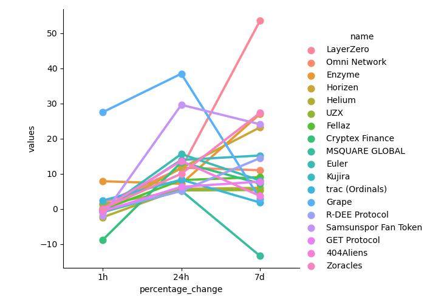
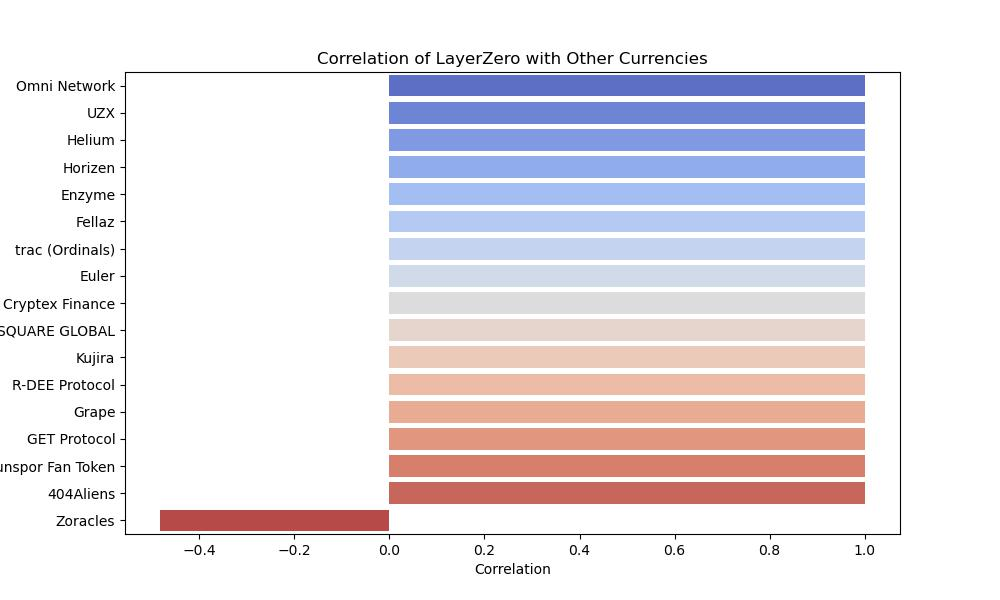

# 🌟 CryptoTrak 🌟

**An intelligent cryptocurrency monitoring application.**

---

## 🚀 Introduction

**CryptoTrak** is designed to help users keep track of the most promising cryptocurrencies in real-time. By leveraging APIs to fetch current prices and performing data analysis, CryptoTrak identifies top-performing coins and sends email notifications to subscribers with direct links to the currencies on [coinmarketcap.com](https://coinmarketcap.com).

---

## ✨ Features

CryptoTrak offers visualization features like:

- **Best performing currencies' price changes plotted against time:**
  

- **Correlation matrix visualization of the top currency against other performers:**
  

---

## ⚙️ Installation

Step-by-step instructions on how to get the application running on a new device.

### 📋 Prerequisites

Ensure you have the following software installed:
- 🐍 **Python 3.x**
- 📦 **Required Python libraries** (`pandas`, `seaborn`, `Matplotlib`, `smtplib`, `requests`)
- 📓 **Jupyter Notebook** (for running as a notebook)
- 🖥️ **VS Code** (for running as a standalone script)

### 🛠️ Steps

1. **Clone the repository**:
    ```sh
    git clone https://github.com/Arch7399/cryptotrak.git
    cd cryptotrak
    ```

2. **Install dependencies**:
    ```sh
    pip install -r requirements.txt
    ```

3. **Configuration**:
    Update the `cryptotrak.py` file with the following options:
    
    - **API_KEY**: Your API key for fetching cryptocurrency data.
    - **SENDER_EMAIL**: The email address from which notifications will be sent.
    - **RECIPIENT_EMAIL**: The email address to receive notifications.
    
    Example `cryptotrak.py`:
    
    ```python
    API_KEY = '0a6w6l20-6d99-8590-9017-139z196k00dd'
    SENDER_EMAIL = 'your_sender_email@example.com'
    RECIPIENT_EMAIL = 'recipient_email@example.com'
    ```

4. **Run the application**:
    ```sh
    python cryptotrak.py
    ```

5. **Usage**

    This code can be used for data visualization on your local device or can be run automatically at intervals when hosted on a cloud server. If you are hosting it on a cloud server and only need the alert functionality, make sure to comment out or delete the visualization sections. Additionally, remove the following code(contains script for creating local csv file and appends data to it, since you're running the script from your cloud server you dont want it to create files there and instead work with fresh data from the market) from the file:
   
    ```python
    if not os.path.isfile(r"pathtocsv\cryptotrak.csv"):
        df.to_csv(r"pathtocsv\cryptotrak.csv", header="column_names")
    else:
        df.to_csv(r"pathtocsv\cryptotrak.csv", mode="a", header=False)
    ```
    
    and set
   
    ```python
    df3 = df
    ```
    
    in the following code:
   
    ```python
    for i in range(1):
        api_runner()
        print("API fetch ran successfully")
        df3 = pd.read_csv(r"pathtocsv\cryptotrak.csv")
    ```

---

## 🤝 Contributing

Contributions are welcome! Follow these steps to contribute:
    
1. **Fork the repository on GitHub.**
2. **Clone the forked repository to your local machine.**
   ```sh
   git clone https://github.com/Arch7399/cryptotrak.git
   cd cryptotrak
   git checkout -b feature/your-feature
   git commit -am 'Add some feature'
   git push origin feature/your-feature
3. Submit a pull request on GitHub


---

## 📜 **License**

This project is licensed under the [MIT License](https://opensource.org/license/mit).
    
Feel free to use, modify, and distribute this code for any purpose.
